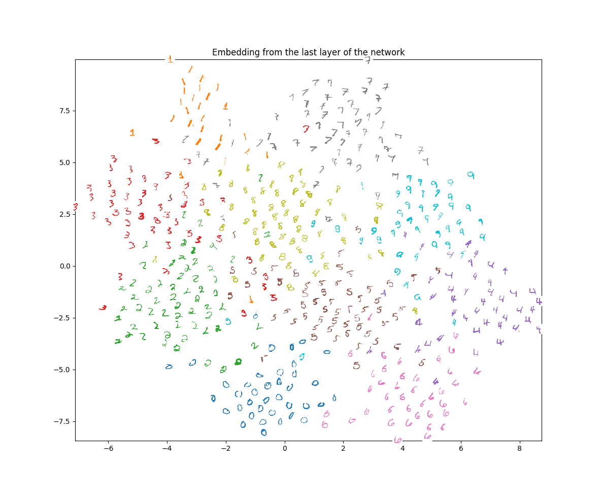

# Implementing Siamese Network using Tensorflow with MNIST

<p align="center">  </p>

I have been interested in Siamese network. To my understanding, it is one way of dealing with weakly supervised problems. Its beauty lies in its simple scheme. It seems Siamese networks (and Triplet network) have been popularly used in many applications such as face similarity and image matching. A [web page](http://andersbll.github.io/deeppy-website/examples/) motivates me to implement a similar Siamese network using Tensorflow.

These codes here embed hand-written digits into 2D space. A loss function controls the embedding to be closer for digits in the same class and further for digits in the different classes. I borrowed visualization part from the original source with a little modification (including colors).

I kept codes minimal for my personal experiments (e.g., different architectures or loss functions).

* `run.py` : nothing but a wrapper for running.
* `inference.py` :  architecture and loss definition. you can modify as you want.
* `visualize.py` : visualizes result.

You can simply run  :

```bash
$ python run.py
...
step 34750: loss 0.179
step 34760: loss 0.113
step 34770: loss 0.078
...
```

This will download and extract MNIST dataset (once downloaded, it will skip downloading next time). Once training done, a result will appear as in the image above. It saves an intermediate model regularly (with names `model.*`) while training.

When you run `run.py`, if an model file exists, you will be asked if you want to load it and continue training from that status. `no` will start training from the scratch. 

```bash
$ python run.py
We found model.ckpt file. Do you want to load it [yes/no]? yes
```

For your convenience, while training, embedding results are keeping updated in `embed.txt`. So you can see an resulting embedding anytime (by stopping training or with a separate cmd/shell while training), using

```bash
$ python visualize.py
```


Please let me know if there are mistakes or comments. Thanks!

Youngwook Paul Kwon